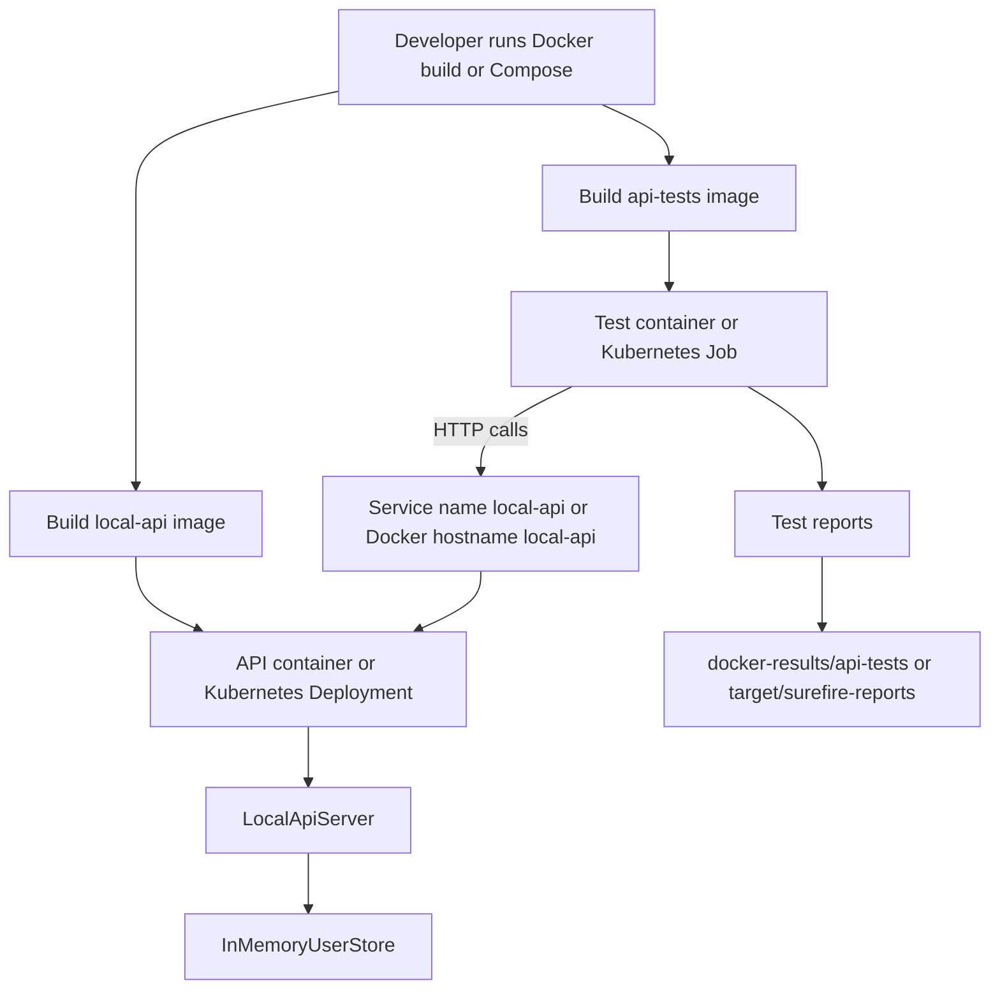

# Docker And Kubernetes Simplified For This Framework

This document explains Docker and Kubernetes in very simple terms, using this project as the example.

If you are new to both, the main thing to remember is:

- Docker is used to package and run applications in containers
- Kubernetes is used to manage and run those containers at scale

So in very simple words:

- Docker creates the box
- Kubernetes manages many boxes

## 1. Why This Matters In This Framework

This framework has two main parts:

1. The local API server
2. The API test runner

When you run everything locally without Docker:

- the API server can start inside the test code
- the tests call it directly on `http://127.0.0.1:9876`

When you use Docker:

- the API server runs in one container
- the tests run in another container

When you use Kubernetes:

- the API server runs in one or more pods
- the tests run in a separate pod as a Job

That means the same framework can run in 3 ways:

1. Local Java process
2. Docker containers
3. Kubernetes cluster

## 2. What Is Docker

Docker is a tool that lets you package your application with everything it needs to run.

Think of a Docker container like a ready-made runtime box:

- it has Java
- it has your code
- it has the startup command

That means the same container can run on different machines with fewer environment issues.

### In this project, Docker is used for:

- packaging the API server into a container image
- packaging the test runner into another container image
- running both together using Docker Compose

## 3. What Is Kubernetes

Kubernetes is a platform that runs and manages containers.

It helps when you want:

- stable deployment
- scaling
- restart on failure
- service discovery
- one-time jobs

In simple terms:

- Docker builds the container image
- Kubernetes runs that image in a managed environment

## 4. How Docker And Kubernetes Are Connected

They are not competing tools. They are used at different stages.

The normal relationship is:

1. Build container image with Docker
2. Store that image in a container registry
3. Tell Kubernetes to run that image

So the connection is:

- Docker creates the image
- Kubernetes uses the image

## 5. Beginner Analogy

Think about food delivery:

- Your code is the food
- Docker is the packaging box
- Kubernetes is the delivery and operations system that decides:
- how many boxes are needed
- where they go
- what happens if one gets damaged

## 6. Requirements For Docker In This Framework

To run Docker for this project, you need:

### Software requirements

- Docker Desktop installed on Windows
- Docker Engine running
- Internet access for initial image pulls

### Project requirements

- `Dockerfile.server`
- `Dockerfile.tests`
- `docker-compose.yml`
- built project source files in the repo

### Practical requirement

Your Docker Desktop must be running before you execute:

```powershell
docker build --file .\Dockerfile.server --tag java-api-framework/local-api:latest .
```

or:

```powershell
docker compose up --build --abort-on-container-exit --exit-code-from api-tests
```

## 7. Requirements For Kubernetes In This Framework

To run Kubernetes for this project, you need:

### Software requirements

- A Kubernetes cluster
- `kubectl` installed
- container images available to the cluster

### Cluster options

You can use:

- Docker Desktop Kubernetes
- Minikube
- Kind
- a cloud cluster like AKS, EKS, or GKE

### Project requirements

- `k8s/local-api-deployment.yaml`
- `k8s/local-api-service.yaml`
- `k8s/api-tests-job.yaml`

### Important note

Kubernetes does not build your code.
It expects images to already exist.

So before Kubernetes can run this framework, you normally do this:

1. build Docker images
2. push them to a registry or make them locally available to the cluster
3. apply Kubernetes yaml files

## 8. What A Container Image Is

A container image is a packaged blueprint of your application.

For this framework we have two images:

### API image

- built from `Dockerfile.server`
- starts the local API server

### Test image

- built from `Dockerfile.tests`
- runs Maven tests against the API

## 9. What Docker Compose Does Here

Docker Compose helps run multiple containers together.

In this project, it starts:

- `local-api`
- `api-tests`

The Compose file also creates a shared network so the test container can call:

```text
http://local-api:9876
```

That works because `local-api` becomes the hostname inside Docker networking.

It also mounts:

```text
./docker-results
```

from your host machine, so Docker test reports remain available outside the container.

## 10. Docker Flow In This Framework

### Step-by-step

1. Docker builds the API image from `Dockerfile.server`
2. Docker builds the test image from `Dockerfile.tests`
3. Docker Compose starts the API container
4. Docker Compose starts the test container
5. The test container runs `mvn test`
6. Tests call `http://local-api:9876`
7. The API container responds
8. Reports are written to `docker-results/api-tests`

## 11. Kubernetes Flow In This Framework

### Step-by-step

1. Docker images are built first
2. Those images are made available to Kubernetes
3. Kubernetes starts the API server as a Deployment
4. Kubernetes exposes the API through a Service named `local-api`
5. Kubernetes starts the API tests as a Job
6. The test Job pod calls `http://local-api:9876`
7. The Service routes traffic to one of the API pods
8. The Job finishes as success or failure

## 12. Main Kubernetes Objects Used Here

### Deployment

Used for the API server.

Why:

- the API should stay running
- it may need multiple replicas
- Kubernetes can restart it automatically

In this project:

- `k8s/local-api-deployment.yaml`

### Service

Used to expose the API pods under one stable name.

Why:

- pod IP addresses can change
- the test job needs a stable address

In this project:

- `k8s/local-api-service.yaml`

### Job

Used for the test execution.

Why:

- tests are not a forever-running app
- they should run once and then stop

In this project:

- `k8s/api-tests-job.yaml`

## 13. Simple Difference Between Docker Compose And Kubernetes

Docker Compose:

- easiest for local multi-container execution
- good for learning and local testing
- runs on one machine

Kubernetes:

- better for scale and shared environments
- supports restart policies, replicas, services, and jobs
- closer to enterprise or cloud execution

## 14. Which One Should You Use First

For your learning path with this framework:

1. Understand local `mvn test`
2. Understand Docker and Docker Compose
3. Then move to Kubernetes

That order is best because:

- local run teaches the Java framework
- Docker teaches containers
- Kubernetes teaches orchestration

## 15. Very Simple End-To-End Flow Diagram

### Local Only

```text
Maven/TestNG
    |
    v
BaseApiTest starts LocalApiServer
    |
    v
Rest Assured sends API calls
    |
    v
LocalApiServer handles /users, /health
    |
    v
InMemoryUserStore stores data
```

### Docker Flow

```text
                +----------------------------------+
                | Host Machine                     |
                |                                  |
                |  docker compose up               |
                +----------------+-----------------+
                                 |
                                 v
          +-----------------------------------------------+
          | Docker Network                                |
          |                                               |
          |  +------------------+    HTTP    +---------+ |
          |  | api-tests        | ---------> | local-  | |
          |  | container        |            | api     | |
          |  | mvn test         | <--------- | server  | |
          |  +------------------+            +---------+ |
          |            |                                    |
          |            v                                    |
          |   writes reports to mounted volume              |
          +------------+------------------------------------+
                       |
                       v
          Host folder: docker-results/api-tests
```

### Kubernetes Flow

```text
             +------------------------------------+
             | Docker Images                      |
             | local-api image                    |
             | api-tests image                    |
             +----------------+-------------------+
                              |
                              v
                +----------------------------------+
                | Kubernetes Cluster               |
                |                                  |
                |  +----------------------------+  |
                |  | Deployment: local-api      |  |
                |  | Pod 1, Pod 2, ...          |  |
                |  +-------------+--------------+  |
                |                |                 |
                |                v                 |
                |        +---------------+         |
                |        | Service       |         |
                |        | name: local-api|        |
                |        +-------+-------+         |
                |                ^                 |
                |                | HTTP            |
                |  +-------------+--------------+  |
                |  | Job: api-tests             |  |
                |  | runs Maven tests once      |  |
                |  +----------------------------+  |
                +----------------------------------+
```

## 16. Mermaid Flow Diagram

If your Markdown viewer supports Mermaid, this shows the same flow.



## 17. How To Learn This Framework In The Right Order

### Stage 1. Learn local execution

Run:

```powershell
mvn test
```

Learn:

- how TestNG starts
- how `BaseApiTest` starts the server
- how `UserApiClient` calls the endpoints

### Stage 2. Learn Docker

Run:

```powershell
docker compose up --build --abort-on-container-exit --exit-code-from api-tests
```

Learn:

- one container can run the API
- another container can run tests
- containers talk over Docker network
- reports are written to `docker-results/api-tests`

### Stage 3. Learn Kubernetes

Run after image setup:

```powershell
kubectl apply -f k8s/local-api-deployment.yaml
kubectl apply -f k8s/local-api-service.yaml
kubectl apply -f k8s/api-tests-job.yaml
```

Learn:

- the API is long-running, so it uses Deployment
- the API gets a stable address through Service
- tests are one-time execution, so they use Job

## 18. Important Practical Truth

Docker and Kubernetes do not replace your test framework.

Your Java framework is still the real test logic.

These technologies only change where and how it runs:

- locally
- inside containers
- inside a cluster

## 19. Quick Command Summary

### Local Java mode

```powershell
mvn test
```

### Docker mode

```powershell
docker compose up --build --abort-on-container-exit --exit-code-from api-tests
```

### Kubernetes mode

```powershell
kubectl apply -f k8s/local-api-deployment.yaml
kubectl apply -f k8s/local-api-service.yaml
kubectl apply -f k8s/api-tests-job.yaml
```

## 20. Final Simple Summary

For this framework:

- Maven runs the tests
- Rest Assured sends the API calls
- Docker packages the API and tests into containers
- Docker Compose runs those containers together on one machine
- Kubernetes runs and manages those containers in a cluster

The simplest understanding is:

- local mode = everything on your machine
- Docker mode = everything in containers
- Kubernetes mode = containers managed by a cluster
