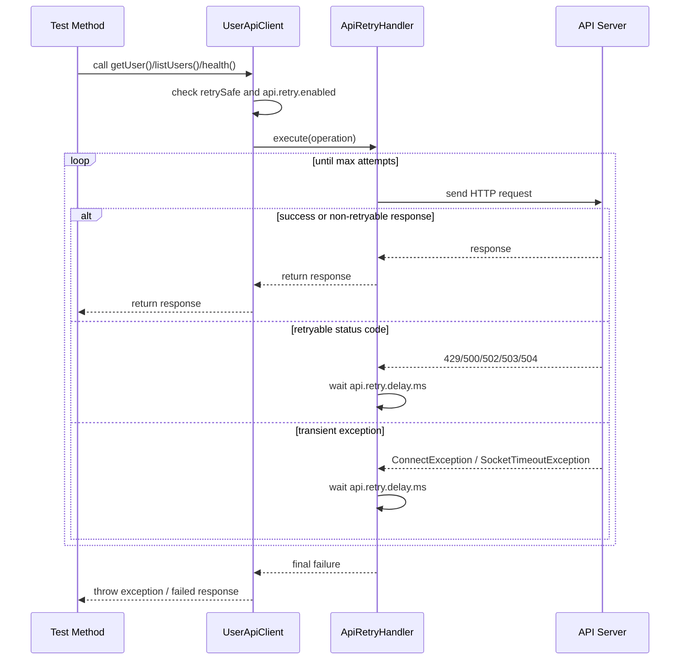

# API Framework Guide

This document explains the full structure of the framework, how the local server works, how the tests call it, how to add new tests, and how Docker and Kubernetes are used in this project.

## 1. What This Project Is

This project is a Java API automation framework built with:

- Maven for dependency management and build execution
- TestNG for test organization and parallel execution
- Rest Assured for HTTP requests and API assertions
- A small embedded Java HTTP server that acts as the local API under test
- Built-in bearer-token authentication with refresh-token support
- Docker for containerized execution
- Kubernetes manifests for running the API and tests in a cluster-style setup

The framework is intentionally simple, but it already has the main building blocks you would use in a scalable API automation project.

## 2. High-Level Flow

The project works like this:

1. Maven starts the TestNG suite.
2. The suite setup in `BaseApiTest` checks whether it should start the embedded local API server.
3. If enabled, the local API server starts on `http://127.0.0.1:9876`.
4. Rest Assured is configured to use that base URL.
5. The token manager obtains and caches bearer tokens when authentication is enabled.
6. Test classes call the API through `UserApiClient`.
7. The local API server validates the bearer token for protected endpoints like `/users`.
8. The server stores user data in memory and returns JSON responses.
9. TestNG reports the results.

That means the test framework and the API under test can run in the same project for local execution, but they can also be separated when you run through Docker or Kubernetes.

## 3. Folder Structure

```text
Java-API/
|-- .dockerignore
|-- .gitignore
|-- docker-compose.yml
|-- Dockerfile.server
|-- Dockerfile.tests
|-- FRAMEWORK_GUIDE.md
|-- README.md
|-- pom.xml
|-- testng.xml
|-- k8s/
|   |-- api-tests-job.yaml
|   |-- local-api-deployment.yaml
|   |-- local-api-service.yaml
|-- src/
|   |-- main/
|   |   |-- java/com/example/framework/model/
|   |   |   |-- Address.java
|   |   |   |-- ApiError.java
|   |   |   |-- AuthTokenRequest.java
|   |   |   |-- AuthTokenResponse.java
|   |   |   |-- CreateOrderRequest.java
|   |   |   |-- CreateProfileRequest.java
|   |   |   |-- CreateUserRequest.java
|   |   |   |-- OrderAudit.java
|   |   |   |-- OrderCustomer.java
|   |   |   |-- OrderItemRequest.java
|   |   |   |-- OrderRecord.java
|   |   |   |-- OrderSummary.java
|   |   |   |-- PaymentDetails.java
|   |   |   |-- ProfileRecord.java
|   |   |   |-- RefreshTokenRequest.java
|   |   |   |-- UserRecord.java
|   |   |-- java/com/example/framework/server/
|   |       |-- InMemoryAuthService.java
|   |       |-- InMemoryNestedPojoStore.java
|   |       |-- InMemoryUserStore.java
|   |       |-- JdbcUserStore.java
|   |       |-- JsonUtil.java
|   |       |-- LocalApiServer.java
|   |       |-- ServerStorageConfig.java
|   |       |-- UserStore.java
|   |-- test/
|       |-- java/com/example/framework/base/
|       |   |-- BaseApiTest.java
|       |-- java/com/example/framework/client/
|       |   |-- ApiRetryHandler.java
|       |   |-- AuthApiClient.java
|       |   |-- AuthTokenManager.java
|       |   |-- NestedPojoApiClient.java
|       |   |-- UserApiClient.java
|       |-- java/com/example/framework/config/
|       |   |-- FrameworkConfig.java
|       |-- java/com/example/framework/data/
|       |   |-- NestedPojoPayloadFactory.java
|       |   |-- UserPayloadFactory.java
|       |-- java/com/example/framework/validation/
|       |   |-- ApiSchemaValidator.java
|       |   |-- ApiResponseValidator.java
|       |   |-- AuthResponseValidator.java
|       |   |-- ErrorResponseValidator.java
|       |   |-- NestedPojoResponseValidator.java
|       |   |-- UserResponseValidator.java
|       |-- java/com/example/framework/tests/
|       |   |-- AuthenticationFlowTest.java
|       |   |-- NestedPojoFlowTest.java
|       |   |-- NegativeScenarioTest.java
|       |   |-- HighVolumeUserApiTest.java
|       |   |-- UserApiFlowTest.java
|       |-- resources/
|           |-- config.properties
|           |-- config-local.properties
|           |-- config-qa.properties
|           |-- config-stage.properties
|           |-- config-prod.properties
|           |-- endpoints.properties
|           |-- schemas/
|               |-- auth-token-response-schema.json
|               |-- error-response-schema.json
|               |-- health-response-schema.json
|               |-- message-response-schema.json
|               |-- order-response-schema.json
|               |-- profile-response-schema.json
|               |-- user-list-response-schema.json
|               |-- user-response-schema.json
```

## 4. File-By-File Explanation

### Root Files

`pom.xml`

- This is the main Maven build file.
- It defines Java version, dependencies, plugins, and runtime properties.
- It includes Rest Assured, TestNG, Jackson, and SLF4J.
- It configures Surefire to run `testng.xml`.
- It also creates a shaded runnable jar for the local API server.

`testng.xml`

- This is the TestNG suite definition.
- It defines which test classes run.
- It enables method-level parallel execution with a default thread count of 10.

`README.md`

- This is the quick-start document.
- It explains how to run locally, package the jar, use Docker, and apply Kubernetes manifests.

`FRAMEWORK_GUIDE.md`

- This document.
- It is the detailed technical explanation of the whole framework.

`.gitignore`

- Prevents generated files and IDE files from being committed.
- Example: `target/`, `.idea/`, `.vscode/`.

`.dockerignore`

- Prevents unnecessary files from being copied into Docker build context.
- This keeps Docker images smaller and builds faster.

`docker-compose.yml`

- Starts two containers together:
- One for PostgreSQL persistent storage
- One for the local API server
- One for the API test runner
- This is useful when you want the API and tests to run as separate containers.
- It also mounts a host results folder so Docker test execution leaves reports outside the container.

`Dockerfile.server`

- Builds the project jar and packages the local API server into a container image.
- The resulting container starts the embedded API server.

`Dockerfile.tests`

- Builds a container that runs Maven tests against a target API URL.
- By default it points to the Compose service `local-api`.

### Kubernetes Files

`k8s/local-api-deployment.yaml`

- Deploys the API server as a Kubernetes Deployment.
- Starts multiple pods running the API server.
- Includes readiness and liveness probes using `/health`.

`k8s/local-api-service.yaml`

- Creates a stable Kubernetes Service named `local-api`.
- Test jobs use this DNS name to call the API.

`k8s/api-tests-job.yaml`

- Runs the test suite as a Kubernetes Job.
- This is useful for one-time execution, like regression or load-style test runs.

### Main Source Files

`src/main/java/com/example/framework/model/CreateUserRequest.java`

- Request model used when creating users.
- It contains `name`, `email`, and `status`.

`src/main/java/com/example/framework/model/UserRecord.java`

- Response model that represents a stored user.
- It contains `id`, `name`, `email`, `status`, and `createdAt`.

`src/main/java/com/example/framework/model/ApiError.java`

- Standard error payload used by the server.
- It currently returns a simple `message`.

`src/main/java/com/example/framework/model/AuthTokenRequest.java`

- Request model used by the token endpoint.
- Contains the username and password for local authentication.

`src/main/java/com/example/framework/model/RefreshTokenRequest.java`

- Request model used by the refresh endpoint.
- Contains the refresh token issued earlier by the API.

`src/main/java/com/example/framework/model/AuthTokenResponse.java`

- Response model returned by token and refresh endpoints.
- Contains access token, refresh token, token type, and both expiry timestamps.

`src/main/java/com/example/framework/model/Address.java`

- Reusable nested address model.
- Used in both the simple and complex nested POJO examples.

`src/main/java/com/example/framework/model/CreateProfileRequest.java`

- Simple nested POJO request example.
- Demonstrates one nested object inside the main payload: `address`.

`src/main/java/com/example/framework/model/ProfileRecord.java`

- Response model for the simple nested POJO example.
- Shows how nested objects are returned from the API and mapped back into Java.

`src/main/java/com/example/framework/model/CreateOrderRequest.java`

- Complex nested POJO request example.
- Demonstrates multiple nested objects and a nested list:
- `customer`
- `items`
- `shippingAddress`
- `paymentDetails`
- `tags`

`src/main/java/com/example/framework/model/OrderRecord.java`

- Response model for the complex nested POJO example.
- Includes server-computed nested blocks such as `summary` and `audit`.

`src/main/java/com/example/framework/server/JsonUtil.java`

- Central JSON helper using Jackson `ObjectMapper`.
- Used for request parsing and response serialization.

`src/main/java/com/example/framework/server/InMemoryUserStore.java`

- This is the local data layer for the server.
- It stores users in memory using `ConcurrentHashMap`.
- It generates unique IDs using `AtomicLong`.
- It supports create, update, get, list, delete, and seed operations.

`src/main/java/com/example/framework/server/UserStore.java`

- Interface for user persistence.
- Lets the API switch between in-memory and PostgreSQL-backed storage without changing endpoint handlers.

`src/main/java/com/example/framework/server/JdbcUserStore.java`

- PostgreSQL-backed implementation of `UserStore`.
- Persists user records in a real database using JDBC.
- Reuses the same create, update, patch, list, delete, and seed behavior as the in-memory implementation.

`src/main/java/com/example/framework/server/ServerStorageConfig.java`

- Reads server storage settings from JVM properties or environment variables.
- Controls whether `/users` uses memory or PostgreSQL at startup.
- Supplies JDBC URL, username, password, and schema-init behavior.

`src/main/java/com/example/framework/server/InMemoryAuthService.java`

- In-memory token service for the embedded API.
- Validates demo credentials.
- Issues access and refresh tokens.
- Validates access-token expiry.
- Rotates token pairs during refresh.

`src/main/java/com/example/framework/server/InMemoryNestedPojoStore.java`

- In-memory store for the simple and complex nested POJO demo endpoints.
- Creates and updates nested profile records.
- Creates and updates nested order records and computes order summaries.

`src/main/java/com/example/framework/server/LocalApiServer.java`

- This is the actual HTTP server used by the tests.
- It uses Java's built-in `HttpServer`.
- It chooses the `/users` storage implementation at startup based on server storage config.
- It registers the endpoints:
- `GET /health`
- `POST /auth/token`
- `POST /auth/refresh`
- `POST /users`
- `GET /users`
- `GET /users/{id}`
- `PUT /users/{id}`
- `PATCH /users/{id}`
- `DELETE /users/{id}`
- `POST /seed?count=10`
- `POST /profiles`
- `PUT /profiles/{id}`
- `PATCH /profiles/{id}`
- `GET /profiles/{id}`
- `DELETE /profiles/{id}`
- `POST /orders`
- `PUT /orders/{id}`
- `PATCH /orders/{id}`
- `GET /orders/{id}`
- `DELETE /orders/{id}`

### Test Source Files

`src/test/resources/config.properties`

- Base runtime configuration for tests.
- Contains:
- `api.env`
- `api.base.url`
- `api.request.count`
- `api.parallel.threads`
- `api.start.embedded.server`
- `api.logging.enabled`
- `api.logging.detail`
- `api.logging.on.validation.failure`
- `api.response.time.assert.enabled`
- `api.response.time.max.ms`
- `api.retry.enabled`
- `api.retry.max.attempts`
- `api.retry.delay.ms`
- `api.retry.retryable.status.codes`
- `api.auth.enabled`
- `api.auth.username`
- `api.auth.password`
- `api.auth.access.token.expiry.skew.seconds`

`src/test/resources/config-local.properties`

- Local environment overrides.
- Used by default because `api.env=local`.

`src/test/resources/config-qa.properties`

- QA environment overrides.
- Intended for a separately running QA API.

`src/test/resources/config-stage.properties`

- Stage environment overrides.
- Intended for a separately running stage API.

`src/test/resources/config-prod.properties`

- Prod environment overrides.
- Intended for controlled production-like execution.

`src/test/java/com/example/framework/config/FrameworkConfig.java`

- Reads values from `config.properties`, then overlays the active environment file.
- Allows system properties to override file-based config.
- Example:
- `mvn test -Dapi.request.count=10000`
- `mvn test -Dapi.env=qa`

`src/test/java/com/example/framework/config/EndpointConfig.java`

- Loads endpoint templates from `endpoints.properties`.
- Gives clients and tests one central place to read paths like users, profiles, auth, and health.

`src/test/java/com/example/framework/config/RestAssuredLoggingConfigurer.java`

- Centralizes Rest Assured logging filter registration.
- Adds request and response logging when enabled.
- Keeps validation-failure logging available without forcing noisy logs on every run.

`src/test/java/com/example/framework/client/UserApiClient.java`

- This is the API client wrapper around Rest Assured.
- Tests should call this class rather than building raw HTTP requests repeatedly.
- It improves reuse and keeps tests clean.
- It now applies configurable retry handling to safer read-style operations such as health and GET calls.
- It now also attaches bearer tokens to protected endpoints and retries once on 401 after invalidating the cached token.
- It supports both full `PUT` updates and partial `PATCH` updates.

`src/test/java/com/example/framework/client/AuthApiClient.java`

- Low-level client for `/auth/token` and `/auth/refresh`.
- Used internally by the token manager and by auth-focused tests.

`src/test/java/com/example/framework/client/AuthTokenManager.java`

- Central synchronized token cache for the test framework.
- Reuses a valid access token when possible.
- Refreshes the token pair when the access token is close to expiry.
- Re-authenticates when no valid refresh token remains.
- Prevents concurrent test threads from refreshing the token at the same time.

`src/test/java/com/example/framework/client/NestedPojoApiClient.java`

- Client wrapper for the nested POJO demo endpoints.
- Calls the simple profile endpoints and complex order endpoints, including both `PUT` and `PATCH` flows.

`src/test/java/com/example/framework/client/ApiRetryHandler.java`

- Shared retry utility for transient API failures.
- Retries configured status codes and transient connection exceptions.
- Keeps retry logic centralized instead of duplicating loops in test classes.

### Retry Flow Diagram

```text
Test Method
    |
    v
UserApiClient
    |
    | Is this operation retry-safe?
    |-- No --> Call API once and return result
    |
    |-- Yes -->
    v
ApiRetryHandler
    |
    v
Send HTTP request
    |
    |-- Success or non-retryable status --> Return response
    |
    |-- Retryable status code? (429, 500, 502, 503, 504)
    |         |
    |         --> wait api.retry.delay.ms --> try again
    |
    |-- Transient exception? (ConnectException, SocketTimeoutException)
              |
              --> wait api.retry.delay.ms --> try again
    |
    v
Max attempts reached
    |
    --> Return final failure / throw exception
```

### Retry Sequence



`src/test/java/com/example/framework/data/UserPayloadFactory.java`

- Generates request payloads for tests.
- Keeps sample payload creation in one place.

`src/test/java/com/example/framework/validation/ApiResponseValidator.java`

- Shared helper for transport-level response checks.
- Centralizes status-code, response-header, JSON content-type, and default response-time validation.
- Provides typed extraction helpers for models and lists.
- Also exposes an explicit response-time helper for endpoint-specific thresholds when needed.

`src/test/java/com/example/framework/validation/ApiSchemaValidator.java`

- Shared helper for JSON schema validation.
- Loads schema files from the test classpath.
- Lets endpoint validators add structure validation without repeating schema matcher code.

`src/test/java/com/example/framework/validation/UserResponseValidator.java`

- Domain-specific validation helper for user API responses.
- Combines response assertions with business-level checks such as field matching and seeded user counts.
- Keeps test methods short and focused on workflow rather than repetitive assertions.
- Now also validates JSON response structure against schema files under `src/test/resources/schemas/`.

`src/test/java/com/example/framework/validation/AuthResponseValidator.java`

- Domain-specific validator for token and unauthorized responses.
- Validates token payload structure and checks authentication failure messages.

`src/test/java/com/example/framework/validation/ErrorResponseValidator.java`

- Generic validator for negative API responses.
- Validates the error schema and checks status-code/message combinations.
- Keeps negative tests clean and readable.

`src/test/java/com/example/framework/validation/NestedPojoResponseValidator.java`

- Validator for the nested POJO demo responses.
- Checks nested object fields and complex computed blocks like order summaries.

`src/test/java/com/example/framework/cleanup/TestDataCleanupManager.java`

- Per-test cleanup registry for created records.
- Uses `ThreadLocal` storage so parallel TestNG methods do not mix cleanup actions.
- Runs delete calls in reverse order after each test method and tolerates already-deleted resources.

`src/test/java/com/example/framework/base/BaseApiTest.java`

- Shared test setup class.
- Starts the embedded API server before the suite if enabled.
- Sets Rest Assured `baseURI`.
- Applies Rest Assured logging configuration.
- Stops the server after the suite completes.

`src/test/java/com/example/framework/tests/AuthenticationFlowTest.java`

- Covers unauthorized access, token issuance, refresh, caching, and synchronized parallel token access.
- Demonstrates how the framework validates authentication end to end.

`src/test/java/com/example/framework/tests/NestedPojoFlowTest.java`

- Covers both nested POJO examples:
- Simple case: `Profile + Address`
- Complex case: `Order + Customer + Items + Shipping + Payment + Summary + Audit`
- Also covers both `PUT` update flows and `PATCH` partial-update flows for both nested endpoint types.
- Demonstrates how nested request bodies and nested response bodies are modelled, sent, stored, and validated.
- Registers created profile and order ids so cleanup happens automatically after each test method.

`src/test/java/com/example/framework/tests/NegativeScenarioTest.java`

- Covers validation failures, invalid ids, missing users, invalid credentials, invalid refresh tokens, and bad bearer tokens.
- Includes `PUT` and `PATCH` negative coverage for missing records, invalid ids, and invalid nested payloads.
- Demonstrates how negative scenarios are validated using reusable error-response helpers.

`src/test/java/com/example/framework/tests/UserApiFlowTest.java`

- Basic functional tests.
- Covers health check, create, full update, partial patch, read, list, delete flow, and seeding.
- Registers created user ids so the framework can clean up automatically after the test.

`src/test/java/com/example/framework/tests/HighVolumeUserApiTest.java`

- Parallel high-volume test class.
- Uses a parallel TestNG data provider.
- Generates many requests based on `api.request.count`.

## 5. How The Server Executes

The local API server is a normal Java class with a `main` method and a `start()` method.

There are two main ways it can run.

### Option 1. It starts inside the test suite

This happens when:

- `api.start.embedded.server=true`

Flow:

1. Maven runs TestNG.
2. `BaseApiTest.beforeSuite()` runs.
3. It checks the config flag.
4. It creates `LocalApiServer`.
5. It starts the server on the configured port.
6. Rest Assured sends requests to that server during tests.

This is the easiest way to run locally because the tests and server start together.

### Option 2. It runs as a standalone process

This happens when you package the jar and run:

```bash
java -Dserver.port=9876 -jar target/rest-api-framework-1.0.0-shaded.jar
```

Then run the tests separately:

```bash
mvn test -Dapi.base.url=http://127.0.0.1:9876 -Dapi.start.embedded.server=false
```

This model is closer to real-world API automation where the application under test already exists outside the test code.

## 6. How Tests Call The Server

The request path is:

1. Test method calls `USER_API_CLIENT`.
2. `UserApiClient` uses Rest Assured methods like `get()`, `post()`, `put()`, `patch()`, or `delete()`.
3. Rest Assured sends the request to the configured `baseURI`.
4. `LocalApiServer` receives the request.
5. The correct handler processes the endpoint.
6. `UserStore` stores or retrieves data using either the in-memory implementation or PostgreSQL-backed JDBC implementation.
7. The server returns JSON.
8. Test extracts and validates the response.

Example for create user:

1. A test builds a `CreateUserRequest`.
2. `UserApiClient.createUser()` sends `POST /users`.
3. `LocalApiServer.UsersHandler.handleCreate()` reads the JSON body.
4. The active `UserStore` implementation stores the user.
5. `UserRecord` is returned as JSON.
6. The test asserts the response.

For partial updates:

1. A test builds a small patch payload such as only `name`, `status`, or nested fields like `address.city`.
2. `UserApiClient.patchUser()` or `NestedPojoApiClient.patchProfile()` sends `PATCH` to the resource endpoint.
3. `LocalApiServer` loads the current stored record.
4. The server deep-merges only the provided fields into the existing payload shape.
5. The merged payload is validated just like a normal full request.
6. The updated record is stored and returned.

Important merge behavior:

- Omitted fields remain unchanged.
- Nested objects merge deeply.
- Arrays are replaced when they are included in the patch payload.

## 7. How To Add More Tests

There are a few clean ways to expand this framework.

### Add a new test class

Create a new file under:

```text
src/test/java/com/example/framework/tests/
```

Example:

```java
package com.example.framework.tests;

import com.example.framework.base.BaseApiTest;
import com.example.framework.data.UserPayloadFactory;
import com.example.framework.model.UserRecord;
import org.testng.Assert;
import org.testng.annotations.Test;

public class UserStatusTest extends BaseApiTest {

    @Test
    public void shouldCreateActiveUser() {
        UserRecord user = USER_API_CLIENT.createUser(UserPayloadFactory.build(2001))
                .then()
                .statusCode(201)
                .extract()
                .as(UserRecord.class);

        Assert.assertEquals(user.getStatus(), "INACTIVE");
    }
}
```

After creating the class, add it to `testng.xml` if you want it included in the default suite.

### Add a new API client method

If you introduce a new endpoint, add the request wrapper in:

```text
src/test/java/com/example/framework/client/UserApiClient.java
```

Example:

```java
public Response updateUser(long userId, Object request) {
    return RestAssured.given()
            .contentType(JSON)
            .accept(JSON)
            .body(request)
            .when()
            .put("/users/{id}", userId);
}
```

This keeps the HTTP layer centralized.

### Add a new payload factory method

If you need more complex payload generation, add helper methods in:

```text
src/test/java/com/example/framework/data/UserPayloadFactory.java
```

This avoids duplicating payload creation in many test classes.

### Add a new endpoint on the local server

If you want the local test API to support more operations:

1. Add request or response models in `src/main/java/com/example/framework/model/`
2. Add data operations in `InMemoryUserStore.java`
3. Add handler logic in `LocalApiServer.java`
4. Add client calls in `UserApiClient.java`
5. Add tests in `src/test/java/com/example/framework/tests/`

## 8. Example For Adding One More Endpoint

Suppose you want to add:

- `PUT /users/{id}`
- `PATCH /users/{id}`

You would update:

`UserRecord` or a new request model

- Add any fields you need for update requests

`InMemoryUserStore`

- Add an `update()` method
- Add a `patch()` method that merges partial payloads with stored data

Or, for persistent storage:

`UserStore` and `JdbcUserStore`

- Keep the handler contract the same
- Change only the storage implementation behind the interface

`LocalApiServer`

- Add request routing for `PUT`
- Add request routing for `PATCH`
- Parse the request body
- Update the in-memory store
- Return the updated user

`UserApiClient`

- Add a `updateUser()` helper method
- Add a `patchUser()` helper method

Tests

- Add positive, negative, and validation scenarios

## 9. Test Data Cleanup Strategy

The framework now includes an automatic cleanup strategy for data created during tests.

How it works:

1. A test creates a user, profile, or order.
2. The test registers that id through helper methods in `BaseApiTest`.
3. `TestDataCleanupManager` stores the delete action in a thread-local stack.
4. After the test method completes, `@AfterMethod` runs the cleanup stack in reverse order.
5. If a resource was already deleted during the test, cleanup accepts `404` and moves on.

Why this matters:

- It keeps tests isolated from one another.
- It is safer for persistent storage runs where data would otherwise remain in PostgreSQL.
- It keeps long Docker and Kubernetes runs from accumulating stale records.
- Reverse-order cleanup is useful when one created object depends on another.

## 10. How Scaling To 10,000 Calls Works Here

The current framework supports high request volume mainly through TestNG data providers and parallel execution.

The important knobs are:

`api.request.count`

- Controls how many payload rows are generated.
- Example:
- `10000` means 10,000 test invocations in the high-volume test.

`api.parallel.threads`

- Controls how many parallel threads Surefire and TestNG use.
- Example:
- `50` means up to 50 concurrent threads for execution.

Example run:

```bash
mvn test -Dapi.request.count=10000 -Dapi.parallel.threads=50
```

Important note:

- 10,000 calls is supported logically by the framework.
- The best thread count depends on machine CPU, memory, and API capacity.
- For very large runs, you may prefer:
- Running against an external API service instead of an embedded one
- Splitting test groups
- Running multiple jobs in Kubernetes
- Adding reporting and metrics

## 11. How Docker Is Used Here

Docker packages software into portable containers.

In this project Docker is used for two different purposes:

1. Run PostgreSQL for persisted user storage
2. Run the API server in a container
3. Run the test suite in another container

### Why Docker helps

- Removes local machine dependency differences
- Makes it easier to share the framework with teammates
- Matches CI/CD execution more closely
- Lets the API and tests run as isolated services

### Dockerfile.server

This file:

1. Uses a Maven image to build the project
2. Packages the shaded jar
3. Uses a smaller JRE image for runtime
4. Starts the local API server

### Dockerfile.tests

This file:

1. Uses a Maven image
2. Copies the source code
3. Sets environment variables for API URL and parallel settings
4. Runs `mvn test`

### docker-compose.yml

This file starts all required containers together.

Service 1:

- `postgres`
- Stores persisted user data on a Docker volume
- Keeps `/users` data available across API container restarts

Service 2:

- `local-api`
- Runs the API server
- Connects to PostgreSQL and uses JDBC-backed user storage

Service 3:

- `api-tests`
- Runs tests against `http://local-api:9876`
- Mounts `./docker-results` from the host into the container
- Writes Maven Surefire reports to `/workspace/docker-results/api-tests`

That hostname works because Docker Compose creates an internal network where the service name becomes the DNS name.

### Docker Commands

Build the API image:

```bash
docker build -f Dockerfile.server -t java-api-framework/local-api:latest .
##or
docker build --file .\Dockerfile.server --tag java-api-framework/local-api:latest .
```

Build the test image:

```bash
docker build -f Dockerfile.tests -t java-api-framework/api-tests:latest .
##or
docker build --file .\Dockerfile.tests --tag java-api-framework/api-tests:latest .
```

Run both:

```bash
docker compose up --build --abort-on-container-exit
```

After the run completes, check the host folder:

```text
docker-results/api-tests/
```

This folder is separate from the normal local Maven output under `target/`, so Docker execution artifacts stay isolated.

### How execution works with Docker

1. Compose builds the API image.
2. Compose builds the test image.
3. PostgreSQL starts first and becomes healthy.
4. The API container starts and connects to PostgreSQL.
5. The test container runs Maven tests.
6. Tests call `http://local-api:9876`.
7. Docker networking routes the request to the API container.
8. User data is persisted in PostgreSQL instead of only in memory.

## 12. What Kubernetes Is

Kubernetes is a platform used to run and manage containers at scale.

You can think of it as the system that helps you:

- Start containers across machines
- Restart failed containers
- Expose services
- Scale replicas
- Run one-time jobs
- Manage production-like deployments

Docker builds the container image.
Kubernetes runs and manages that image.

## 13. How Kubernetes Is Used In This Project

This project uses Kubernetes in a simple but useful way.

### API server runs as a Deployment

Defined in:

```text
k8s/local-api-deployment.yaml
```

Why Deployment is used:

- The API should stay running
- You may want multiple replicas
- Kubernetes can restart pods automatically

### API is exposed through a Service

Defined in:

```text
k8s/local-api-service.yaml
```

Why Service is used:

- Pods can change over time
- The Service gives a stable name: `local-api`
- Test jobs call the Service instead of a direct pod IP

### Tests run as a Job

Defined in:

```text
k8s/api-tests-job.yaml
```

Why Job is used:

- Tests are a one-time workload
- They should run, complete, and stop
- Kubernetes tracks whether the job succeeded or failed

## 14. How Test Execution Works In Kubernetes

The flow is:

1. Build and tag container images
2. Make those images available to your Kubernetes cluster
3. Apply the API Deployment
4. Apply the API Service
5. Apply the test Job
6. The test pod starts and runs Maven tests
7. The test pod calls `http://local-api:9876`
8. The Kubernetes Service routes the traffic to one of the API pods
9. The job completes with pass or fail result

Example commands:

```bash
kubectl apply -f k8s/local-api-deployment.yaml
kubectl apply -f k8s/local-api-service.yaml
kubectl apply -f k8s/api-tests-job.yaml
```

Useful commands after that:

```bash
kubectl get pods
kubectl get svc
kubectl logs job/api-tests
kubectl delete job api-tests
```

## 15. Why Kubernetes Helps For API Testing

Kubernetes becomes useful when:

- You want to run tests in a CI/CD or shared environment
- You want to scale the application pods
- You want to separate test runners from the application
- You want repeatable and isolated execution
- You want production-like behavior

For example:

- You can increase API server replicas
- You can run different test jobs with different values
- You can point the same test framework to dev, QA, or staging environments

## 16. Embedded Server vs Docker vs Kubernetes

Embedded server mode

- Best for fast local development
- Simplest setup
- One command can start everything

Docker mode

- Best for consistent local or CI execution
- Keeps API and tests in separate containers
- Closer to real deployment behavior

Kubernetes mode

- Best for scaled or shared environments
- Gives replica management, service discovery, and job orchestration
- Best foundation for enterprise execution patterns

## 17. Common Ways You Can Extend This Framework

You can evolve this project in several directions.

Functional growth:

- Add authentication APIs
- Add validation negative scenarios
- Add schema validation
- Tune endpoint-specific response-time thresholds
- Add bulk-update endpoints

Framework growth:

- Add environment profiles for dev, QA, stage, prod
- Add reporting like Allure or ExtentReports
- Add request and response logging filters

Scalability growth:

- Run multiple test jobs in parallel
- Parameterize environment variables in Kubernetes
- Add persistent storage instead of in-memory store
- Use a real API instead of embedded mock server
- Add metrics and observability

## 18. Recommended Way To Work With This Framework

For local development:

```bash
mvn test
```

For higher local load:

```bash
mvn test -Dapi.request.count=10000 -Dapi.parallel.threads=50
```

For separated execution:

1. Start standalone API server
2. Run tests against it with `api.start.embedded.server=false`

For persisted local server execution:

1. Start PostgreSQL
2. Start the API server with `-Dserver.user.store.type=jdbc`
3. Pass `-Ddb.url`, `-Ddb.username`, and `-Ddb.password`
4. Run tests against that server with `api.start.embedded.server=false`

For containerized execution:

```bash
docker compose up --build --abort-on-container-exit
```

For Kubernetes execution:

1. Build images
2. Push them to a registry your cluster can access
3. Update image names in the yaml if needed
4. Apply deployment, service, and job manifests

## 19. Important Current Limitations

This framework is a strong starter base, but it is still intentionally basic.

Current limitations:

- Persistent storage is currently implemented only for `/users`
- Nested profile and order demo endpoints still use in-memory storage
- No HTML reporting is configured
- No advanced load metrics are collected
- Kubernetes manifests assume images are already available in the cluster

## 20. Suggested Next Improvements

If you want to evolve this into a more production-style framework, the next good steps are:

1. Add environment-specific config files
2. Add logging filters for Rest Assured
3. Add response validation helpers
4. Add Allure reporting
5. Add JSON Patch or RFC 6902 support alongside the current merge-patch behavior
6. Add CI pipeline support
7. Add Helm chart or Kustomize for Kubernetes templating
8. Extend PostgreSQL-backed persistence from `/users` to profiles and orders

## 21. Quick Reference Commands

Run tests locally:

```bash
mvn test
```

Run 10,000 API calls:

```bash
mvn test -Dapi.request.count=10000 -Dapi.parallel.threads=50
```

Package server jar:

```bash
mvn -DskipTests package
```

Run server manually:

```bash
java -Dserver.port=9876 -jar target/rest-api-framework-1.0.0-shaded.jar
```

Run server manually with PostgreSQL-backed `/users` storage:

```bash
java -Dserver.port=9876 -Dserver.user.store.type=jdbc -Ddb.url=jdbc:postgresql://localhost:5432/api_framework -Ddb.username=postgres -Ddb.password=postgres -jar target/rest-api-framework-1.0.0-shaded.jar
```

Run tests against external running server:

```bash
mvn "-Dapi.base.url=http://127.0.0.1:9876" "-Dapi.start.embedded.server=false" test
```

Run with Docker Compose:

```bash
docker compose up --build --abort-on-container-exit
```

Apply Kubernetes manifests:

```bash
kubectl apply -f k8s/local-api-deployment.yaml
kubectl apply -f k8s/local-api-service.yaml
kubectl apply -f k8s/api-tests-job.yaml
```

## 22. Final Summary

This framework gives you:

- A local API under test
- A Java TestNG and Rest Assured automation layer
- A scalable parallel test design
- Docker-based execution support
- Kubernetes-based execution support

The most important idea is that your tests are decoupled from how the API runs.

You can run against:

- an embedded local server
- a standalone jar
- a Docker container
- a Kubernetes service

That makes the same automation framework usable from laptop to CI to container platform.


